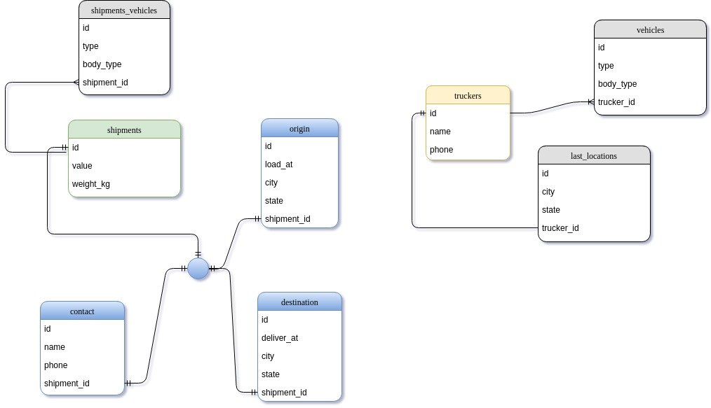

# truck-api
Projeto voltado para atender rotas Pré-Definidas


# Crie uma aplicação Rails com as seguintes características:
---
* Implemente endpoints que atendam as rotas definidas em rotas;
* Para as rotas de POST e PUT, efetue verificação de obrigatoriedade e formato dos dados e retorne uma resposta JSON apropriada com detalhes de falhas de preenchimento, retornando HTTP Code 422;
* Criar a modelagem de banco de dados necessária para suportar  as informações de todos os endpoints;
* Criar testes funcionais automatizados para validar o funcionamento dos serviços criados. Utilize o framework de testes de sua preferência.

## Ambiente de Desenvolvimento
*   Clone este repositorio
*   Siga o tutorial de instalação do Ruby on Rails em: [http://rubyonrails.org/]
*   Execute os comandos abaixo dentro do diretório do projeto
 * `bundle install`
 * `rake db:create`
 * `rake db:migrate`
* Suba o servidor rails rodando o comando  `rails s -b 0.0.0.0`
* O Projeto estara disponivel em `http://localhost:3000`
* 

## Configuraçes do ambiente
* Ruby version: 2.3.1
* Rails version: 5.1.4
* Banco de dados: SQlite


# Documentação da API
---
##### Baixe as coleções já prontas para uso aqui: . Importe as coleções no **Postman**, siga o tutorial: 
---

## Criar pedido de carga
#### **POST /api/shipments** 

* ###### HTTP/1.1 201 Created
```json
    {
        "shipment": {
            "value": 1500.0,
            "weight_kg": 2000,
            "contact": {
                "name": "Carlos", "phone": "(11) 98765-4321"
            },
            "vehicles": [
                { "type": "Truck", "body_type": "Baú" },
                { "type": "Truck", "body_type": "Sider" }
            ],
            "origin": { "city": "São Paulo", "state": "SP", "load_at": "2017-09-25" },
            "destination": { "city": "Goiânia", "state": "GO", "deliver_at": "2017-09-29" }
        }
    }
```
**Aguarde o retorno do código 201 com a mensagem**:
```json
    {
    "id": 1,
    "value": 1500,
    "weight_kg": 2000,
    "created_at": "2017-10-09T02:34:55.819Z",
    "updated_at": "2017-10-09T02:34:55.819Z",
    "url": "http://localhost:3000/api/shipments/1"
    }
```

---
### **Visualizar pedido de carga**
#### GET /api/shipments/1  
**informar número do pedido na url**
> 
```json
    {
        "id": 1,
        "shipment": {
            "value": 1500.0,
            "weight_kg": 2000,
            "contact": {
                "name": "Carlos", "phone": "(11) 98765-4321"
            },
            "vehicles": [
                { "type": "Truck", "body_type": "Baú" },
                { "type": "Truck", "body_type": "Sider" }
            ],
            "origin": { "city": "São Paulo", "state": "SP", "load_at": "2017-09-25" },
            "destination": { "city": "Goiânia", "state": "GO", "deliver_at": "2017-09-29" },
        }
```
---
### **Cadastrar Caminhoneiro**
#### POST /api/truckers   
**Informe os dados do caminhoneiro na body do Post**
> 
```json
    {
        "trucker": {
            "name": "Lincoln Falcão",
            "phone": "(11) 97654-3210",
            "vehicle": {
                "type": "Truck", 
                "body_type": "Baú"
            }
        }
    }
```

---
### **Alterar última localização de caminhoneiro**
#### PUT /api/truckers/1/last_location 
**Informe os dados da ultima atualização no body do envio**
```json
      {
        "location": {
            "city": "São Paulo",
            "state": "SP"
                    }   
    }
```
---
### **Localizar Caminhoneiro por perto**
#### GET /api/shipments/1/nearby_truckers
**Informe o ID do pedido**

```json
    {
        "trucker": {
            "id": 1,
            "name": "Lincoln Falcão",
            "phone": "(11) 97654-3210",
            "vehicle": [
                {
                    "type": "Truck",
                    "body_type": "Baú"
                }
            ]
        }
    }
```

----
### Entidades e Relacionamentos



